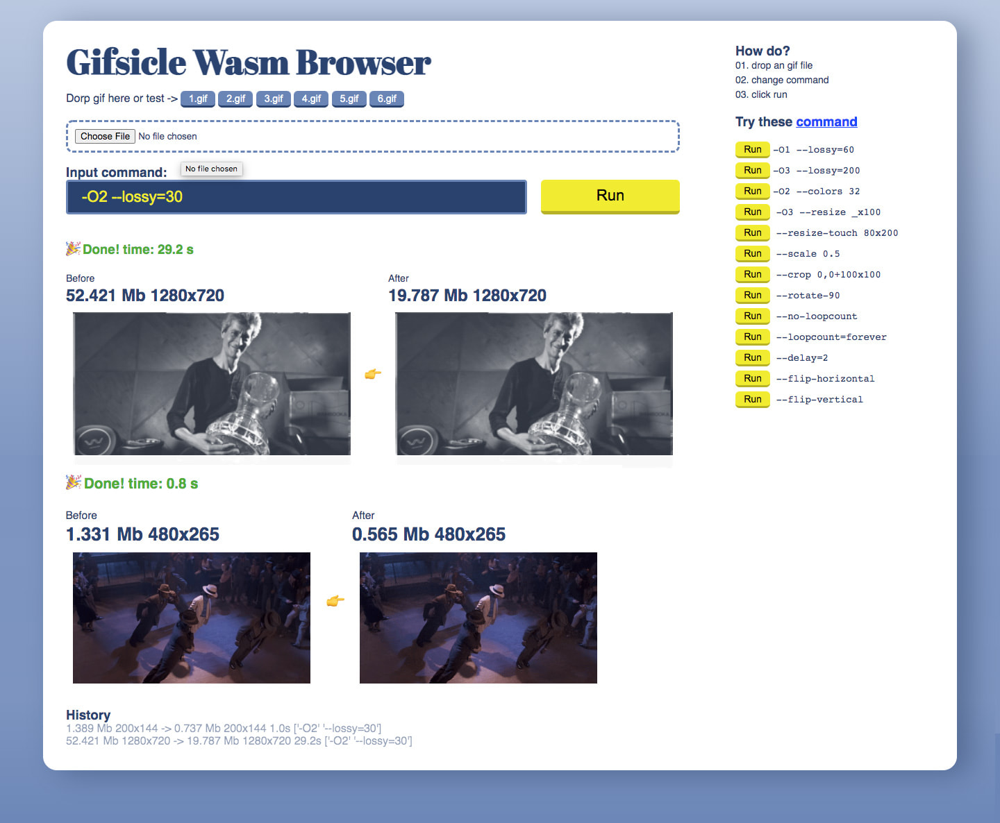

<p align="right">
    <a href="./README.md">En</a> | Chinese
</p>
<p align="center">
    
</p>
<h1 align="center">Gifsicle Wasm Browser</h1>

<p align="center" >
    <a href="https://www.npmjs.com/package/gifsicle-wasm-browser">
        
    </a>
    <a href="https://unpkg.com/gifsicle-wasm-browser/dist/gifsicle.min.js">
        
    </a>
</p>

Use workers and WebAssembly to run Gifsicle in the browser to compress, crop, manipulate frames, resize, etc. Gif images.

Modified from the node.js version of Gifsicle [wasm-codecs](https://github.com/cyrilwanner/wasm-codecs/tree/master/packages/gifsicle).



# Table of contents

- [Function]()
- [demo]()
- [Quick Start]()
- [Api]()
- [hint]()
- [example]()
- [Skill]()
- [Browser support]()
# Function

- Fully implement the functions of Gifsicle
- Supports input and output of multiple Gifs
- Supports multiple commands
- Small size (Gzip≈144KB)
- Independent without dependencies
-

# Demo

- [full demo](https://renzhezhilu.github.io/gifsicle-wasm-browser/demo/)
- [vue demo]()
- [cdn demo](https://codepen.io/random233/pen/BaYEwvr)

# quick start

## npm

````bash
 npm i gifsicle-wasm-browser --save
````

````javascript
import gifsicle from "gifsicle-wasm-browser";

gifsicle
  .run({
    input: [
      {
        file: "./cat.gif",
        name: "1.gif",
      },
    ],
    command: ["--resize 100x_ 1.gif -o /out/out.gif"],
  })
  .then(async(d) => {
    console.log(d);
    // [File]
  });
````

## cdn

```html
<script type="module">
     import gifsicle from 'https://unpkg.com/gifsicle-wasm-browser/dist/gifsical.min.js'
      ...
  })
</script>
````

# Api

## run(input=[],command=[],folder=[])

- ### input
  - `Array`: input Gif file
    - ###file
      - `String`: network url or relative path
      - `File` , `Blob` , `ArrayBuffer`: local files obtained via \<input type=load />
    - ### name
      - `String`: the filename that will be used in command
- ### command
  - `Array`: command to execute
- ### folder
  - `Array`: (optional) folder name that will be used in command

### Precautions

- The name in the input can be customized, but cannot be repeated.
- The last line of command must contain `-o /out/**.gif`,
- The default available directories are `/` , `/out` , `/tem`, when the command is executed, all files in `/out` will be exported

[demo](https://codepen.io/random233/pen/mdXgqwK?editors=1001)

````javascript
let cropGif = await gifsicle.run({
  input: [
    {
      file: "https://media2.giphy.com/media/13CoXDiaCcCoyk/200.gif",
      name: "1.gif",
    },
    {
      file: "https://media3.giphy.com/media/yFQ0ywscgobJK/giphy.gif",
      name: "2.gif",
    },
  ],
  folder: ["/one", "/two"],
  command: [
    "--crop 0,0+100x100 1.gif -o /out/1.gif",
    "--crop 0,0+100x100 2.gif -o /out/2.gif",
  ],
});
````

- The command will be executed one by one in sequence, please use multiple gifsicle.run() when you need to process multiple Gifs at the same time.

[demo](https://codepen.io/random233/pen/ZErZavQ?editors=1000)

````javascript
let url = ["1.gif", "2.gif", "3.gif", "4.gif", "5.gif"];
function cropGif(url) {
  return new Promise((res, rej) => {
    gifsicle
      .run({
        input: [
          {
            file: url,
            name: "1.gif",
          },
        ],
        command: ["--crop 0,0+100x100 1.gif -o /out/out.gif"],
      })
      .then((d) => res(d[0]));
  });
}
let cropAll = url.map((m) => cropGif(m));
let out = await Promise.all(cropAll);
````

- Reverse [demo](https://codepen.io/random233/pen/zYRXVZr?editors=1011)

````javascript
function reverse(input = "../docs/1.gif") {
  return new Promise((res, rej) => {
    gifsicle
      .run({
        input: [
          {
            file: input,
            name: "1.gif",
          },
        ],
        command: ["-b 1.gif", "-U 1.gif #-1-0 -o /out/out.gif"],
      })
      .then((d) => {
        res(d[0]);
      });
  });
}
````

- Export all frames [demo](https://codepen.io/random233/pen/VwQNJMr?editors=1011)

````javascript
function exportFrame(input = "../docs/1.gif") {
  return new Promise((res, rej) => {
    gifsicle
      .run({
        input: [
          {
            file: input,
            name: "1.gif",
          },
        ],
        command: ["1.gif -o /out/out.gif"],
      })
      .then((g1) => {
        gifsicle
          .run({
            input: [
              {
                file: g1[0],
                name: "2.gif",
              },
            ],
            command: ["--explode -U 2.gif -o /out/out.gif"],
          })
          .then((g2) => {
            res(g2[0]);
          });
      });
  });
}
````

- Cut excess transparency [demo](https://codepen.io/random233/pen/jOZRjzg?editors=1000)

````javascript
function cropTransparent(input = "../docs/t2.gif") {
  return new Promise((res, rej) => {
    gifsicle
      .run({
        input: [
          {
            file: input,
            name: "1.gif",
          },
        ],
        command: [
          "--crop-transparency --batch 1.gif",
          "--rotate-180 --batch 1.gif",
          "--rotate-180 --crop-transparency 1.gif -o /out/out.gif",
        ],
      })
      .then((d) => {
        res(d[0]);
      });
  });
}
````

- Merge after modification [demo](https://codepen.io/random233/pen/WNMWqyq?editors=1001)

````javascript
function mergeGif(input = [], w = 100, h = 100) {
  return new Promise(async (res, rej) => {
    let resize = input.map((m) => resizeCover(m, w, h));
    Promise.all(resize).then((d) => {
      let input = d.map((m, index) => {
        return {
          file: m,
          name: `${index}.gif`,
        };
      });
      let command = (_) => {
        let str = "";
        input.map((m) => (str += ` ${m.name}`));
        return [`--merge ${str} -o /out/out.gif`];
      };
      gifsicle.run({ input, command: command() }).then(async(d) => {
        res(d[0]);
      });
    });
  });
}
````

- Export Gif info [demo](https://codepen.io/random233/pen/JjpVQxr?editors=1001)

````javascript
function getInfo(input = "../docs/t1_2.gif") {
  return new Promise((res, rej) => {
    function exportKeyRex(text, before, after, mode = 1, range = "ig") {
      let rex;
      if (mode === 1) {
        rex = new RegExp(`${before}.*?${after}`, range);
      } else if (mode === 2) {
        rex = new RegExp(`${before}.*?(?=${after})`, range);
      } else if (mode === 3) {
        rex = new RegExp(`(?<=${before}).*?(?=${after}).*?`, range);
      }
      return text.match(rex);
    }
    function loop(text) {
      let count = exportKeyRex(text, "loop ", "\n", 3);
      if (count && count[0]) {
        if (count[0].includes("forever")) return 0;
        return count[0].replace(/[^0-9]/gi, "") - 1 + 2;
      } else {
        return 1;
      }
    }
    function size(text) {
      let st = exportKeyRex(text, "logical screen ", "\n", 3);
      st = st[0].split("x");
      return {
        width: st[0] - 0,
        height: st[1] - 0,
      };
    }
    function frames(text) {
      let arr = text.split(" + image").filter((d) => d.includes("#"));
      arr = arr.map((f) => {
        let palettet = exportKeyRex(f, "local color table \\[", "\\]\n", 3);
        if (palettet && palettet[0]) palettet = palettet[0] - 0;
        return {
          index: exportKeyRex(f, "#", " ", 3) - 0,
          transparent: exportKeyRex(f, "transparent ", "\n", 3)[0] - 0,
          disposal: exportKeyRex(f, "disposal ", " ", 3)[0],
          delay: exportKeyRex(f, "delay ", "s", 3)[0] - 0,
          palettet,
        };
      });
      return arr;
    }
    gifsicle
      .run({
        input: [
          {
            file: input,
            name: "1.gif",
          },
        ],
        command: ["--info 1.gif -o /out/out.txt"],
      })
      .then(async(d) => {
        let file = d[0];
        let text = await file.text();
        try {
          let getF = frames(text);
          res({
            images: getF.length,
            palettet:
              exportKeyRex(text, "global color table \\[", "\\]\n", 3)[0] - 0,
            loop: loop(text),
            frames: getF,
            ...size(text),
          });
        } catch (error) {
          throw error;
          res(null);
        }
      });
  });
}
````

- Override Mode Resize [demo](https://codepen.io/random233/pen/PoQgrrL?editors=1001)

````javascript
function resizeCover(input = "../docs/1.gif", outWidth = 200, outHeight = 500) {
  return new Promise(async (res, rej) => {
    // Calculate size transformation
    function computeWidthHeight(
      inWidth,
      inHeight,
      outWidth,
      outHeight,
      scale = 1
    ) {
      let w, h;
      if (outWidth && outHeight) {
        w = outWidth;
        h = outHeight;
      } else if (outWidth) {
        w = outWidth;
        h = (w / inWidth) * inHeight;
      } else if (outHeight) {
        h = outHeight;
        w = (h / inHeight) * inWidth;
      } else {
        w = inWidth * scale;
        h = inHeight * scale;
      }
      w = (w - 0).toFixed(0);
      h = (h - 0).toFixed(0);
      return {
        w,
        h,
      };
    }
    let info = await getInfo(input);
    console.log(info);
    let { width, height } = info;
    let scale =
      outWidth / width > outHeight / height
        ? outWidth / width
        : outHeight / height;
    let outSize = computeWidthHeight(width, height, null, null, scale);
    let pos = {
      x: 0,
      y: 0,
    };
    if (outSize.h > outHeight) {
      pos.y = (outSize.h - outHeight) / 2;
      pos.y = pos.y.toFixed(0);
    }
    if (outSize.w > outWidth) {
      pos.x = (outSize.w - outWidth) / 2;
      pos.x = pos.x.toFixed(0);
    }

    gifsicle
      .run({
        input: [
          {
            file: input,
            name: "1.gif",
          },
        ],
        command: [
          `-b --resize ${outSize.w}x${outSize.h} --use-colormap=1.gif 1.gif`,
          `--colors 256 --crop ${pos.x},${pos.y}+${outWidth}x${outHeight} --use-colormap=1.gif 1.gif -o /out/out. gif`,
        ],
      })
      .then(async(d) => {
        res(d[0]);
      });
  });
}
````

# other

[Gifsicle Command Manual](https://www.lcdf.org/gifsicle/man.html)

# author

gifsicle-wasm-browser is [@renzhezhilu](https://github.com/renzhezhilu) at [wasm-codecs/gifsicle](https://github.com/cyrilwanner/wasm-codecs/tree/master/packages/ gifsicle) and [gifsicle](https://github.com/kohler/gifsicle)

# To do

- [x] single Gif input and output
- [x] Multiple Gif input and output (full version)
- [x] Npm
- [ ] Multi-core processing ([SharedArrayBuffer](https://developer.mozilla.org/zh-CN/docs/Web/JavaScript/Reference/Global_Objects/SharedArrayBuffer))