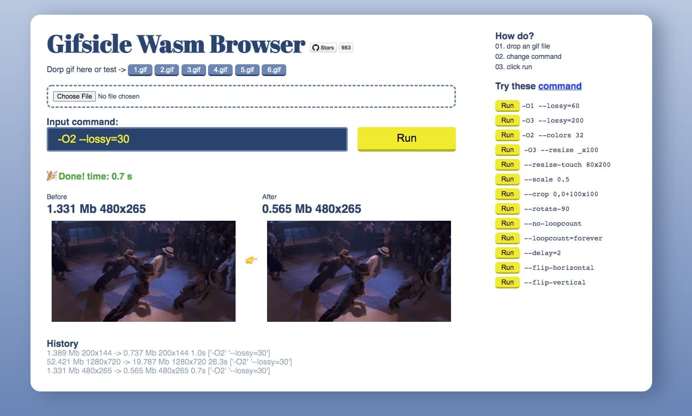

<p  align="right">
    En |
    <a href="./README_CN.md">中文</a>
</p>
<p align="center">
    
</p>
<h1 align="center">Gifsicle Wasm Browser</h1> 


Run Gifsicle with worker and WebAssembly in browser,Compress, rotate, crop and other operations on Gif images.

Modified from the node.js version of Gifsicle [wasm-codecs](https://github.com/cyrilwanner/wasm-codecs/tree/master/packages/gifsicle).




# Demo
[Complete demo](https://renzhezhilu.github.io/gifsicle-wasm-browser/demo/) 

[Simple demo](https://renzhezhilu.github.io/gifsicle-wasm-browser/demo/simple.html)

[Simple demo use cdn(codepen)](https://codepen.io/random233/pen/xxYLeJd)

[Gif crop](https://imagestool.com/gif-crop)


# Quick setup
[Download code](https://github.com/renzhezhilu/gifsicle-wasm-browser/archive/refs/heads/main.zip)

```javascript
(async function(){

    let command = ['-O2', '--lossy=30','--rotate-90']
    let buffer = await fetch('./1.gif').then(file => file.arrayBuffer())
    gifsicleWorker({buffer,command},
        '../dist/gifsicleWorker.min.js'
    ).then(blob => {
        // success
        console.log(blob)
        // blob return -> Blob size: 736843 type: "image/gif"
    }).catch(e => {
        // error
        console.error(e);
    })

    function gifsicleWorker(post = {}, workerUrl = '') {
        return new Promise((res, rej) => {
            let worker = new Worker(workerUrl);
            worker.postMessage(post);
            worker.onmessage = function (e) {
                if (!e.data) {
                    worker.terminate();
                    rej(e)
                    return
                }
                worker.terminate();
                res(e.data)
            };
            worker.onerror = function (e) {
                worker.terminate();
                rej(e)
            };
        })
    }

})()
```
## Normal call
gifsicle.min.js、gifsicle.wasm and gifsicleWorker.min.js must be in the same directory
```javascript
...
    gifsicleWorker({buffer,command},
        '../dist/gifsicleWorker.min.js'
    )
...
```

## Single file call
All files are packed in gifsicleWorkerAllInPack.min.js
```javascript
...
    gifsicleWorker({buffer,command},
        '../dist/gifsicleWorkerAllInPack.min.js'
    )
...
```
## Cdn
[jsdelivr](https://www.jsdelivr.com/package/gh/renzhezhilu/gifsicle-wasm-browser?path=dist)

# Docs
[Gifsicle manual](https://www.lcdf.org/gifsicle/man.html)

# Author
gifsicle-wasm-browser is developed by [@renzhezhilu](https://github.com/renzhezhilu) on the basis of [wasm-codecs/gifsicle](https://github.com/cyrilwanner/wasm-codecs/tree/master/packages/gifsicle) and [gifsicle](https://github.com/kohler/gifsicle )


# To do
- [x] Single Gif input and output
- [x] Multiple Gif input and output (full version)
- [x] Npm
- [ ] Multi-core processing


