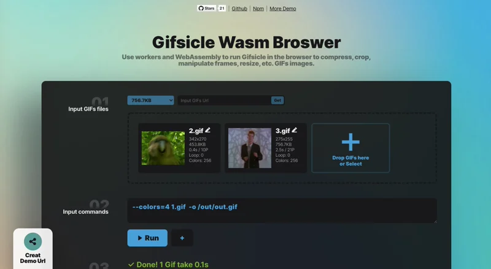

<p align="right">
   En | <a href="./README_CN.md">中文</a>
</p>
<p align="center">
  
</p>
<h1 align="center">Gifsicle Wasm Browser</h1>

<p align="center">
  <a href="https://www.npmjs.com/package/gifsicle-wasm-browser">
    
  </a>
  <a href="https://unpkg.com/gifsicle-wasm-browser/dist/gifsicle.min.js">
    
  </a>
</p>
<p align="center">
  Run Gifsicle in your browser to compress, crop, frame, resize, and more on GIFs.

</p>

<p align="center">
  
</p>

<!-- # directory

- [Function]()
- [Demo]()
- [Quick Start]()
- [Api]()
- [hint]()
- [Browser support]() -->
# Function

- Fully restore the functionality of Gifsicle 1.92
- Supports input and output of multiple GIFs
- Supports multiple commands
- Small (Gzip≈150KB)
- no dependencies

# Demo
## Basic usage
For more commands, please refer to the [Gifsicle Manual](https://www.lcdf.org/gifsicle/man.html).


<table>
  <tr>
    <th>Compression</th>
     <th>Action Frame</th>
     <th>Crop</th>
     <th>Size</th>
     <th>Other</th>
  </tr>
  <tr>
    <td>
      <a href="https://renzhezhilu.github.io/gifsicle-wasm-browser/?share=eyJpbnB1dCI6W3siZmlsZSI6Imh0dHBzOi8vbWVkaWEuZ2lwaHkuY29tL21lZGlhL0ROeGd1M3NnMldjdncwbUlDSy9naXBoeS5naWYiLCJuYW1lIjoiMS5naWYifV0sImNvbW1hbmQiOlt7InZhbHVlIjoiLU8xIC0tbG9zc3k9MjAgMS5naWYgIC1vIC9vdXQvb3V0LmdpZiJ9XSwiem9vbSI6MX0=">Low</a><br />
      <a href="https://renzhezhilu.github.io/gifsicle-wasm-browser/?share=eyJpbnB1dCI6W3siZmlsZSI6Imh0dHBzOi8vbWVkaWEuZ2lwaHkuY29tL21lZGlhL0ROeGd1M3NnMldjdncwbUlDSy9naXBoeS5naWYiLCJuYW1lIjoiMS5naWYifV0sImNvbW1hbmQiOlt7InZhbHVlIjoiLU8yIC0tbG9zc3k9NDAgMS5naWYgIC1vIC9vdXQvb3V0LmdpZiJ9XSwiem9vbSI6MX0=">middle</a>
      <br />
      <a href="https://renzhezhilu.github.io/gifsicle-wasm-browser/?share=eyJpbnB1dCI6W3siZmlsZSI6Imh0dHBzOi8vbWVkaWEuZ2lwaHkuY29tL21lZGlhL0ROeGd1M3NnMldjdncwbUlDSy9naXBoeS5naWYiLCJuYW1lIjoiMS5naWYifV0sImNvbW1hbmQiOlt7InZhbHVlIjoiLU8zIC0tbG9zc3k9MTYwIDEuZ2lmICAtbyAvb3V0L291dC5naWYifV0sInpvb20iOjF9">high</a>
      <br /><br /><br /><br /><br /><br /><br />
    </td>
    <td>
      <a
        href="https://renzhezhilu.github.io/gifsicle-wasm-browser/?share=eyJpbnB1dCI6W3siZmlsZSI6Imh0dHBzOi8vbWVkaWEuZ2lwaHkuY29tL21lZGlhL0ZHZzRkQjZqWlFZdFcvZ2lwaHkuZ2lmIiwibmFtZSI6IjEuZ2lmIn1dLCJjb21tYW5kIjpbeyJ2YWx1ZSI6IjEuZ2lmICMtMS0tMiAtbyAvb3V0L291dC5naWYifV0sInpvb20iOjF9">Select the last 2 frames</a><br />
      <a
        href="https://renzhezhilu.github.io/gifsicle-wasm-browser/?share=eyJpbnB1dCI6W3siZmlsZSI6Imh0dHBzOi8vbWVkaWEyLmdpcGh5LmNvbS9tZWRpYS8xM0NvWERpYUNjQ295ay8yMDAuZ2lmIiwibmFtZSI6IjEuZ2lmIn1dLCJjb21tYW5kIjpbeyJ2YWx1ZSI6IjEuZ2lmICMwLTIgIy0xLS0zICAtbyAvb3V0L291dC5naWYifV0sInpvb20iOjF9">Select 3 frames before and after</a><br />
      <a
        href="https://renzhezhilu.github.io/gifsicle-wasm-browser/?share=eyJpbnB1dCI6W3siZmlsZSI6Imh0dHBzOi8vbWVkaWEyLmdpcGh5LmNvbS9tZWRpYS8xM0NvWERpYUNjQ295ay8yMDAuZ2lmIiwibmFtZSI6IjEuZ2lmIn1dLCJjb21tYW5kIjpbeyJ2YWx1ZSI6IjEuZ2lmIC0tZGVsZXRlICMwLTIwIC1vIC9vdXQvb3V0LmdpZiJ9XSwiem9vbSI6MX0=">delete the first 20 frames</a><br />
      <a
        href="https://renzhezhilu.github.io/gifsicle-wasm-browser/?share=eyJpbnB1dCI6W3siZmlsZSI6Imh0dHBzOi8vbWVkaWEyLmdpcGh5LmNvbS9tZWRpYS8xM0NvWERpYUNjQ295ay8yMDAuZ2lmIiwibmFtZSI6IjEuZ2lmIn0seyJmaWxlIjoiaHR0cHM6Ly9tZWRpYTIuZ2lwaHkuY29tL21lZGlhL05tOFpQQUdPd1pVUU0vMjAwLmdpZiIsIm5hbWUiOiIyLmdpZiJ9XSwiY29tbWFuZCI6W3sidmFsdWUiOiItYiAtLXJlc2l6ZSAyNDF4MjAwIDIuZ2lmIn0seyJ2YWx1ZSI6IiAxLmdpZiAtLXJlcGxhY2UgIzItNSAgMi5naWYgICAtbyAvb3V0L291dC5naWYifV0sInpvb20iOjF9">Replace 3-6 frames with other GIFs</a><br />
      <a
        href="https://renzhezhilu.github.io/gifsicle-wasm-browser/?share=eyJpbnB1dCI6W3siZmlsZSI6Imh0dHBzOi8vbWVkaWEuZ2lwaHkuY29tL21lZGlhLzF5QzJnZUJtSkpiaE1XYnl5Ni9naXBoeS5naWYiLCJuYW1lIjoiMS5naWYifV0sImNvbW1hbmQiOlt7InZhbHVlIjoiMS5naWYgIy0xLTAgICAtbyAvb3V0L291dDEuZ2lmIn0seyJ2YWx1ZSI6Ii1VIDEuZ2lmICMtMS0wICAgLW8gL291dC9vdXQyLmdpZiJ9XSwiem9vbSI6IjAuOSJ9">rewind</a><br />
      <a
        href="https://renzhezhilu.github.io/gifsicle-wasm-browser/?share=eyJpbnB1dCI6W3siZmlsZSI6Imh0dHBzOi8vbWVkaWEuZ2lwaHkuY29tL21lZGlhL25qT04zakVtVFlIRWZSYmZzay8yMDAuZ2lmIiwibmFtZSI6IjIuZ2lmIn0seyJmaWxlIjoiaHR0cHM6Ly9tZWRpYS5naXBoeS5jb20vbWVkaWEvSXAzckk4VzFZY1hITzVNeUhRL2dpcGh5LmdpZiIsIm5hbWUiOiIxLmdpZiJ9XSwiY29tbWFuZCI6W3sidmFsdWUiOiItYiAgLVUgICAtLXJlc2l6ZSAxMDB4MTAwIDEuZ2lmIn0seyJ2YWx1ZSI6Ii1iICAtVSAgLS1yZXNpemUgMTAweDEwMCAyLmdpZiAifSx7InZhbHVlIjoiLVUgIFxuMS5naWYgLS1hcHBlbmQgIzAgIDIuZ2lmICMwIFxuMS5naWYgLS1hcHBlbmQgIzEgIDIuZ2lmICMxIFxuMS5naWYgLS1hcHBlbmQgIzIgIDIuZ2lmICMyIFxuMS5naWYgICAgLS1hcHBlbmQgIzMgIDIuZ2lmICMzIFxuMS5naWYgIC0tYXBwZW5kICM0ICAyLmdpZiAjNCBcbjEuZ2lmICAtLWFwcGVuZCAjNSAgMi5naWYgIzUgXG4tbyAvb3V0L291dC5naWYifV0sInpvb20iOiIwLjkifQ==">Alternate 2 GIFs</a><br />
      <a
        href="https://renzhezhilu.github.io/gifsicle-wasm-browser/?share=eyJpbnB1dCI6W3siZmlsZSI6Imh0dHBzOi8vbWVkaWEuZ2lwaHkuY29tL21lZGlhL2hUaDliU2JVUFdNV2svZ2lwaHkuZ2lmIiwibmFtZSI6IjEuZ2lmIn1dLCJjb21tYW5kIjpbeyJ2YWx1ZSI6Ii1lIC1VIDEuZ2lmICAtbyAvb3V0L291dC5naWYifV0sInpvb20iOiIwLjYifQ==">export all frames</a><br />
        <br />
        <br />
        <br />
    </td>
     <td>
      <a href="https://renzhezhilu.github.io/gifsicle-wasm-browser/?share=eyJpbnB1dCI6W3siZmlsZSI6Imh0dHBzOi8vbWVkaWE0LmdpcGh5LmNvbS9tZWRpYS9uUjRMMTBYbEpjU2VRLzIwMC5naWYiLCJuYW1lIjoiMS5naWYifV0sImNvbW1hbmQiOlt7InZhbHVlIjoiLS1jcm9wIDMwLDAtMTgwLDExMCAxLmdpZiAgLW8gL291dC9vdXQuZ2lmIn1dLCJ6b29tIjoxfQ==">According to the upper left and lower right corners</a><br />
      <a href="https://renzhezhilu.github.io/gifsicle-wasm-browser/?share=eyJpbnB1dCI6W3siZmlsZSI6Imh0dHBzOi8vbWVkaWE0LmdpcGh5LmNvbS9tZWRpYS9uUjRMMTBYbEpjU2VRLzIwMC5naWYiLCJuYW1lIjoiMS5naWYifV0sImNvbW1hbmQiOlt7InZhbHVlIjoiLS1jcm9wIDMwLDArMTUweDExMCAxLmdpZiAgLW8gL291dC9vdXQuZ2lmIn1dLCJ6b29tIjoxfQ==">According to the upper left corner and height and width</a><br />
      <a href="https://renzhezhilu.github.io/gifsicle-wasm-browser/?share=eyJpbnB1dCI6W3siZmlsZSI6Imh0dHBzOi8vbWVkaWE0LmdpcGh5LmNvbS9tZWRpYS9uUjRMMTBYbEpjU2VRLzIwMC5naWYiLCJuYW1lIjoiMS5naWYifV0sImNvbW1hbmQiOlt7InZhbHVlIjoiLS1yb3RhdGUtOTAgLS1jcm9wIDUwLDArMTAweDEwMCAxLmdpZiBcbi1vIC9vdXQvcm90YXRlLT5jcm9wLmdpZiJ9XSwiem9vbSI6MX0=">Crop after rotation</a><br />
      <a href="https://renzhezhilu.github.io/gifsicle-wasm-browser/?share=eyJpbnB1dCI6W3siZmlsZSI6Imh0dHBzOi8vbWVkaWE0LmdpcGh5LmNvbS9tZWRpYS9uUjRMMTBYbEpjU2VRLzIwMC5naWYiLCJuYW1lIjoiMS5naWYifV0sImNvbW1hbmQiOlt7InZhbHVlIjoiLS1jcm9wIDUwLDArMTAweDEwMCAxLmdpZiBcbi1vIC9vdXQvbm90LWZsaXAuZ2lmIn0seyJ2YWx1ZSI6Ii0tZmxpcC1ob3Jpem9udGFsIC0tY3JvcCA1MCwwKzEwMHgxMDAgMS5naWYgXG4tbyAvb3V0L2ZsaXAuZ2lmIn1dLCJ6b29tIjoxfQ==">Crop after flip</a><br />
      <a href="https://renzhezhilu.github.io/gifsicle-wasm-browser/?share=eyJpbnB1dCI6W3siZmlsZSI6Imh0dHBzOi8vbWVkaWEuZ2lwaHkuY29tL21lZGlhL0ZHZzRkQjZqWlFZdFcvZ2lwaHkuZ2lmIiwibmFtZSI6IjEuZ2lmIn1dLCJjb21tYW5kIjpbeyJ2YWx1ZSI6Ii1iIC0tY3JvcC10cmFuc3BhcmVuY3kgIDEuZ2lmIn0seyJ2YWx1ZSI6Ii1iIC0tcm90YXRlLTE4MCAgIDEuZ2lmIn0seyJ2YWx1ZSI6Ii0tcm90YXRlLTE4MCAtLWNyb3AtdHJhbnNwYXJlbmN5IFxuMS5naWYgIC1vIC9vdXQvb3V0LmdpZiJ9XSwiem9vbSI6MX0=">Cut out excess transparency</a><br />
      <br />
      <br /><br /><br />
    </td>
    <td>
      <a href="https://renzhezhilu.github.io/gifsicle-wasm-browser/?share=eyJpbnB1dCI6W3siZmlsZSI6Imh0dHBzOi8vbWVkaWEuZ2lwaHkuY29tL21lZGlhL0ZHZzRkQjZqWlFZdFcvZ2lwaHkuZ2lmIiwibmFtZSI6IjEuZ2lmIn1dLCJjb21tYW5kIjpbeyJ2YWx1ZSI6Ii0tcmVzaXplIDEwMHhfXG4xLmdpZiAgLW8gL291dC9vdXQuZ2lmXG4ifV0sInpvb20iOjF9">Modify the width to 100px</a><br />
      <a href="https://renzhezhilu.github.io/gifsicle-wasm-browser/?share=eyJpbnB1dCI6W3siZmlsZSI6Imh0dHBzOi8vbWVkaWEuZ2lwaHkuY29tL21lZGlhL0ZHZzRkQjZqWlFZdFcvZ2lwaHkuZ2lmIiwibmFtZSI6IjEuZ2lmIn1dLCJjb21tYW5kIjpbeyJ2YWx1ZSI6Ii0tc2NhbGUgMC41XG4xLmdpZiAgLW8gL291dC9vdXQuZ2lmXG4ifV0sInpvb20iOjF9">Shrink by 50%</a><br />
      <a href="https://renzhezhilu.github.io/gifsicle-wasm-browser/?share=eyJpbnB1dCI6W3siZmlsZSI6Imh0dHBzOi8vbWVkaWEuZ2lwaHkuY29tL21lZGlhL0ZHZzRkQjZqWlFZdFcvZ2lwaHkuZ2lmIiwibmFtZSI6IjEuZ2lmIn1dLCJjb21tYW5kIjpbeyJ2YWx1ZSI6Ii1TIDUwMHg1MDBcbjEuZ2lmICAtbyAvb3V0L291dDEuZ2lmXG4ifSx7InZhbHVlIjoiLVMgNTAweDUwMCAtcCAxMjAsMTIwXG4xLmdpZiAgLW8gL291dC9vdXQyLmdpZlxuIn1dLCJ6b29tIjoxfQ==">Modify aspect ratio</a><br />
      <br /><br /><br /><br /><br /><br /><br /><br />
    </td>
    <td>
      <a href="https://renzhezhilu.github.io/gifsicle-wasm-browser/?share=eyJpbnB1dCI6W3siZmlsZSI6Imh0dHBzOi8vbWVkaWEuZ2lwaHkuY29tL21lZGlhLzludVhSeDVFZkdzS2MvZ2lwaHkuZ2lmIiwibmFtZSI6IjEuZ2lmIn1dLCJjb21tYW5kIjpbeyJ2YWx1ZSI6Ii0tbG9vcGNvdW50PTEgMS5naWYgIC1vIC9vdXQvbG9vcC0xLmdpZiJ9LHsidmFsdWUiOiItLWxvb3Bjb3VudD0yIDEuZ2lmICAtbyAvb3V0L2xvb3AtMi5naWYifSx7InZhbHVlIjoiLS1sb29wY291bnQ9MCAxLmdpZiAgLW8gL291dC9sb29wLWZvcmV2ZXIuZ2lmIn1dLCJ6b29tIjoiMC43In0=">loop</a><br />
      <a href="https://renzhezhilu.github.io/gifsicle-wasm-browser/?share=eyJpbnB1dCI6W3siZmlsZSI6Imh0dHBzOi8vbWVkaWEuZ2lwaHkuY29tL21lZGlhL0k1MWlnR0Nvc1pqOTB5M1Y5TC9naXBoeS5naWYiLCJuYW1lIjoiMS5naWYifV0sImNvbW1hbmQiOlt7InZhbHVlIjoiLS1pbmZvIDEuZ2lmICAtbyAvb3V0L2luZm8udHh0In1dLCJ6b29tIjoiMS41In0=">read info</a><br />
      <a href="https://renzhezhilu.github.io/gifsicle-wasm-browser/?share=eyJpbnB1dCI6W3siZmlsZSI6Imh0dHBzOi8vbWVkaWEuZ2lwaHkuY29tL21lZGlhL0k1MWlnR0Nvc1pqOTB5M1Y5TC9naXBoeS5naWYiLCJuYW1lIjoiMS5naWYifSx7ImZpbGUiOiJodHRwczovL21lZGlhLmdpcGh5LmNvbS9tZWRpYS9uak9OM2pFbVRZSEVmUmJmc2svMjAwLmdpZiIsIm5hbWUiOiIyLmdpZiJ9LHsiZmlsZSI6Imh0dHBzOi8vbWVkaWEuZ2lwaHkuY29tL21lZGlhLzludVhSeDVFZkdzS2MvZ2lwaHkuZ2lmIiwibmFtZSI6IjMuZ2lmIn1dLCJjb21tYW5kIjpbeyJ2YWx1ZSI6Ii0tbWVyZ2UgMS5naWYgMi5naWYgMy5naWYgIC1vIC9vdXQvaW5mby5naWYifV0sInpvb20iOiIxLjEifQ==">merge</a><br />
      <a href="https://renzhezhilu.github.io/gifsicle-wasm-browser/?share=eyJpbnB1dCI6W3siZmlsZSI6Imh0dHBzOi8vbWVkaWEuZ2lwaHkuY29tL21lZGlhL25qT04zakVtVFlIRWZSYmZzay8yMDAuZ2lmIiwibmFtZSI6IjEuZ2lmIn1dLCJjb21tYW5kIjpbeyJ2YWx1ZSI6Ii1kMTAwIDEuZ2lmIC1vIC9vdXQvMXMuZ2lmIn0seyJ2YWx1ZSI6Ii1kNTAgMS5naWYgLW8gL291dC8wLjVzLmdpZiJ9LHsidmFsdWUiOiItZDEwIDEuZ2lmIC1vIC9vdXQvMC4xcy5naWYifSx7InZhbHVlIjoiLWQzIDEuZ2lmIC1vIC9vdXQvMC4wM3MuZ2lmIn1dLCJ6b29tIjoiMC41In0=">Play speed</a><br />
      <br /><br /><br /><br />
    </td>
    <!-- <td>
      <a href="xx">xx</a><br />
      <br />
      <a href="xx">xx</a>
      <br />
      <a href="xx">xx</a>
      <br /><br /><br /><br /><br />
    </td> -->
  </tr>
</table>


## Complete example
[gifsicleTool.js](./docs/js/gifsicleTool.js) By combining multiple commands, it can complete more practical functions.

- [Merge after modifying size](https://codepen.io/random233/pen/WNMWqyq?editors=1001)
- [Overlay Mode Resize](https://codepen.io/random233/pen/PoQgrrL?editors=1001)
- [Parse Gif information](https://codepen.io/random233/pen/JjpVQxr?editors=1001)
- [play backwards](https://codepen.io/random233/pen/zYRXVZr?editors=1011)
- [Export all frames](https://codepen.io/random233/pen/VwQNJMr?editors=1011)
- [Cut excess transparency](https://codepen.io/random233/pen/jOZRjzg?editors=1000)


# Quick start

## npm install

[import in vue](https://codesandbox.io/s/crimson-lake-jbuudt?file=/src/App.vue)
````
$ npm i gifsicle-wasm-browser --save
````

````javascript
import gifsicle from "gifsicle-wasm-browser";

gifsicle.run({
  input: [{
      file: "./cat.gif",
      name: "1.gif",
  }],
  command: ["--resize 100x_ 1.gif -o /out/out.gif"],
})
.then(async(d) => {
  console.log(d);
  // [File]
});
````

## cdn
[cdn demo](https://codepen.io/random233/pen/BaYEwvr)

```html
<script type="module">
  import gifsicle from 'https://unpkg.com/gifsicle-wasm-browser/dist/gifsical.min.js'
  // or
  import gifsicle from 'https://cdn.jsdelivr.net/npm/gifsicle-wasm-browser/dist/gifsicle.min.js'
      ...
  })
</script>
````

# Api

## gifsicle.run()

### input
  - `Array`: input Gif file
  - ### file
    - `String`: the web url of the GIF
    - `File` , `Blob` , `ArrayBuffer`: local files obtained via  `<input type=load />`
  - ### name
    - `String`: the filename that will be used in `command`
### command
  - `Array`: command to execute
### folder
  - `Array`: (optional) folder name to be used in `command`
### isStrict
  - `Boolean`: (optional) `command` ends immediately on error
  - default: `false`


# Tips

- `name` in `input` can be customized, but cannot be repeated.
- The last line of `command` must contain `-o /out/**.gif`,
- The default available directories are `/` , `/out` , `/tem`, when `command` is executed, all files in `/out` will be exported
- `command` will be executed one by one in sequence, please use multiple `gifsicle.run()` if you need to process multiple GIFs at the same time. [Execute sequentially](https://codepen.io/random233/pen/mdXgqwK?editors=1001) | [Execute simultaneously](https://codepen.io/random233/pen/ZErZavQ?editors=1000)


# Author

gifsicle-wasm-browser is [@renzhezhilu](https://github.com/renzhezhilu) at
[wasm-codecs/gifsicle](https://github.com/cyrilwanner/wasm-codecs/tree/master/packages/gifsicle) and
Developed on the basis of [gifsicle](https://github.com/kohler/gifsicle).

# To do
- [x] single Gif input and output
- [x] Multiple Gif input and output (full version)
- [x] Npm
- [ ]
Multi-core processing ([SharedArrayBuffer](https://developer.mozilla.org/zh-CN/docs/Web/JavaScript/Reference/Global_Objects/SharedArrayBuffer))