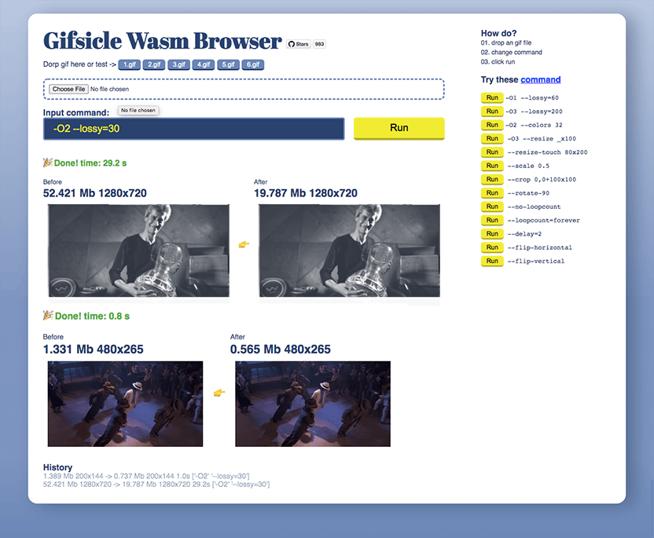

    

    En
    <a href="#">中文</a>

<h1 align="center">Gifsicle Wasm Browser</h1> 

在浏览器中使用worker运行Gifsicle，
通过Gifsicle的node.js版本[wasm-codecs](https://github.com/cyrilwanner/wasm-codecs/tree/master/packages/gifsicle)修改而来。

https://github.com/cyrilwanner/wasm-codecs/tree/master/packages/gifsicle#license

https://www.lcdf.org/gifsicle/man.html

https://github.com/kohler/gifsicle